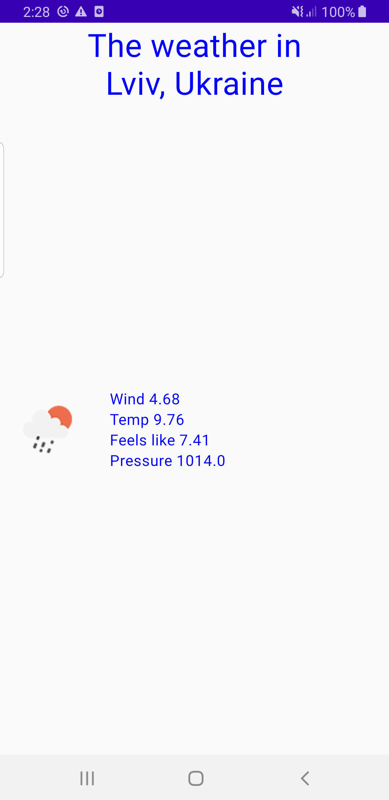
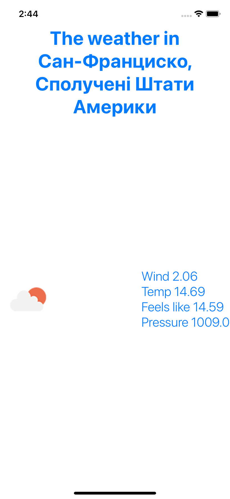
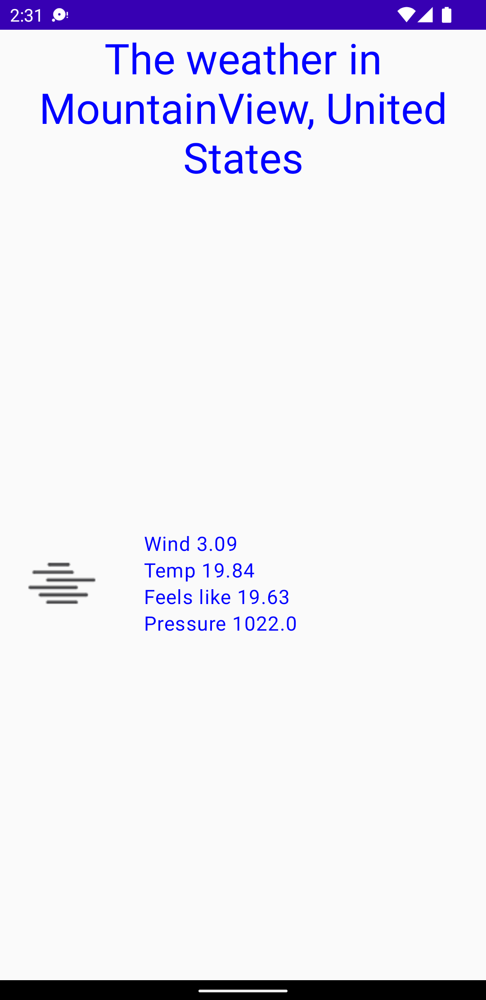

# KMM_WeatherForecastApp
KMM playground project.

It uses platform specific APIs to retrieve current location in order to get weather forecast for this location for today.
Retrieved forecast is saved in local storage (UserDefaults/SharedPreferences).
As backend server to retrieve weather forecast [OpenWeatherAPI][https://openweathermap.org/current] is used.
# Architecture:
shared module contains data, domain and presentation (viewmodel) common logic
UI layer is written in native UI declarative frameworks (SwiftUI, Compose UI)
# Used dependencies
[Ktor](https://ktor.io/docs/getting-started-ktor-client.html#add-dependencies) for networking

[Ktor serialization](https://ktor.io/docs/serialization.html)

[Mockk](https://mockk.io/) for testing
# Screenshots

